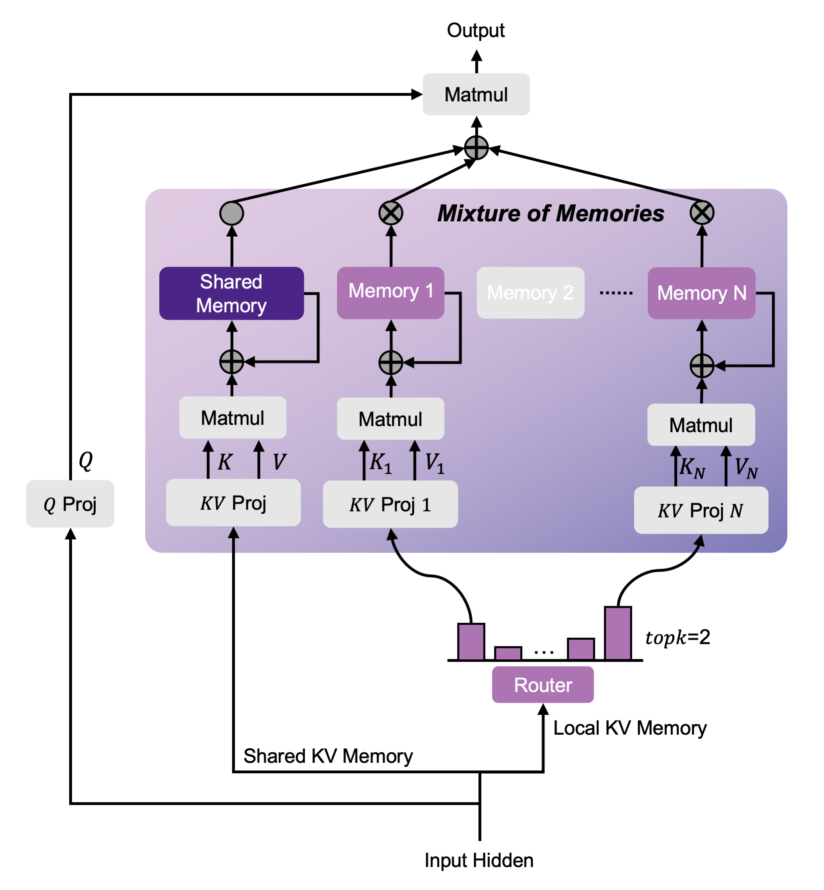

<div align="center">

# Mixture-of-Memories

</div>

Welcome to MoM! This repository provides the implementation of [MoM: Linear Sequence Modeling with Mixture-of-Memories](https://arxiv.org/abs/2502.13685), on huggingface eco-system. We would like to note that MoM is compatible with all kinds of linear sequence modeling methods like: linear attention, SSM, linear RNN, etc. **Here is an introductory artical about MoM (in Chinese) on [Zhihu](https://zhuanlan.zhihu.com/p/25066090353)**.

<p align="center">
  
</p>
<div align="center">
MoM Architecture
</div>

## Installation

First, create a new virtual environment and install the required dependencies:
```bash
conda create --name mom python=3.10
conda activate mom
pip install -r requirements.txt
```

## Getting Started

### Data Preparation
Before training, make sure to preprocess your data by following the steps outlined in [training/README.md](training/README.md).

### Training From Scratch

To start training with the default setup, simply run:
```bash
cd trainning
bash cmd_mom.sh
```

You can also
- Modify the script to adjust the training configuration.
- Modify the [training/configs/mom.json](training/configs/mom.json) to adjust the MoM structure.

### Evaluation

To evaluate MoM on **commonsense reasoning benchmarks**, you can run:
```bash
bash eval.sh
```

To evaluate MoM on **recall-intensive tasks**, please follow the instructions in [Prefix Linear Attention](https://github.com/HazyResearch/prefix-linear-attention).

## Acknowledgement
This repo builds upon the open-source [flash-linear-attention](https://github.com/fla-org/flash-linear-attention). Happy experimenting. 🔥🚀🔥

## Citation
If you find this repo useful, please consider citing our paper:
```bib
@article{du2025mom,
  title={MoM: Linear Sequence Modeling with Mixture-of-Memories},
  author={Du, Jusen and Sun, Weigao and Lan, Disen and Hu, Jiaxi and Cheng, Yu},
  journal={arXiv preprint arXiv:2502.13685},
  year={2025}
}
```